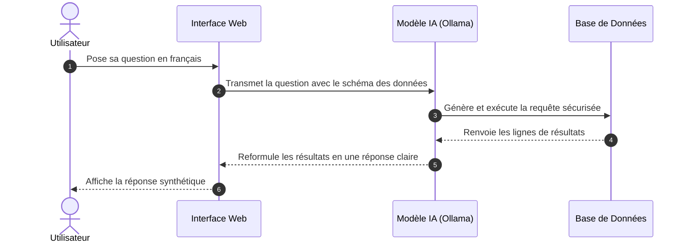

# Poser une Question à l'Assistant

L'assistant NaturSQL a été conçu pour répondre à vos interrogations quotidiennes concernant les cours, les enseignants et les emplois du temps universitaires.

---

## 💬 Comment poser une question ?

1. Rendez-vous sur l'écran principal de discussion (**Chat**).
2. Dans le champ de texte situé en bas de l'écran, tapez votre question en français naturel.
3. Validez en appuyant sur la touche **Entrée** ou en cliquant sur l'icône **Envoyer**.
4. L'assistant analyse votre demande, effectue la recherche dans la base de données et formule une réponse claire en quelques secondes.

!!! note "Emplacement Capture d'Écran : Espace de discussion"
    > **[Capture d'écran à insérer]**  
    > *Visuel attendu : Fenêtre de discussion avec une question posée dans le champ texte et la réponse de l'assistant dans la bulle de conversation.*

---

## 💡 Exemples de questions types

Pour vous inspirer, voici une sélection de requêtes courantes que l'assistant maîtrise parfaitement :

=== "Affectation des enseignants"

    * *« Quels sont les enseignants de TP en informatique ? »*
    * *« Qui assure les cours magistraux de bases de données au semestre 2 ? »*
    * *« Donne-moi la liste des enseignants intervenant en mathématiques cette année. »*

=== "Volumes horaires & Services"

    * *« Quel est le volume total d'heures de cours dispensé par M. Martin ? »*
    * *« Combien d'heures de TD sont prévues pour le module de système d'exploitation ? »*
    * *« Quel enseignant a le plus d'heures de TP programmées ce semestre ? »*

=== "Statuts & Vacataires"

    * *« Quels sont les enseignants ayant le statut de vacataire ? »*
    * *« Donne-moi les vacataires qui interviennent dans les matières du BUT 2. »*

=== "Maquettes & Prérequis"

    * *« Quelles sont les matières enseignées au cours du semestre 1 ? »*
    * *« Quels sont les prérequis obligatoires pour s'inscrire au cours d'intelligence artificielle ? »*
    * *« Combien d'heures d'anglais sont programmées sur l'année scolaire 2024-2025 ? »*

---

## 🔍 Comment fonctionne l'assistant en coulisses ?

Vous n'avez pas besoin de comprendre la technique pour utiliser l'application, mais voici les grandes étapes de traitement :

1. **Compréhension** : Le modèle d'intelligence artificielle lit votre question et en extrait l'intention métier.
2. **Recherche ciblée** : Une requête d'interrogation sécurisée en lecture seule est envoyée à la base de données de l'établissement.
3. **Synthèse** : Les données brutes récupérées sont traduites en une phrase naturelle et directement exploitable.
