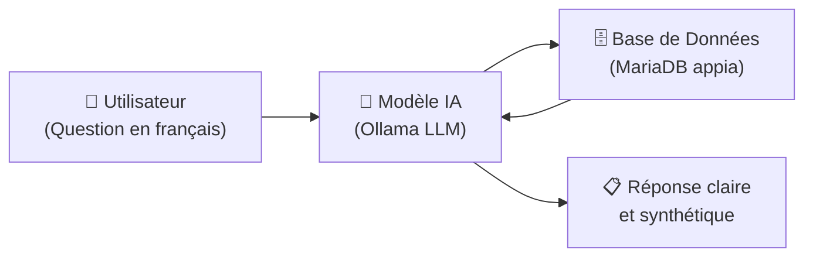

# NaturSQL : Assistant Intelligent de Données Pédagogiques

  
  
<em>Interrogez vos maquettes, services enseignants et prérequis en français naturel.</em>

---

Bienvenue sur la documentation officielle de **NaturSQL**, la solution logicielle développée dans le cadre de la SAE Application Intelligente à l'IUT Littoral Côte d'Opale (Calais).

NaturSQL permet aux équipes pédagogiques (responsables de formation, secrétariats, enseignants) d'interroger une base de données relationnelle complexe sans aucune connaissance en programmation ni en langage SQL.

---

## 🎯 Pourquoi NaturSQL ?

Dans un établissement d'enseignement supérieur, l'accès aux données pédagogiques (répartition des heures de CM/TD/TP, affectations des enseignants, maquettes des semestres, prérequis) repose souvent sur de multiples tableurs ou sur des requêtes manuelles réservées aux experts en bases de données.

**NaturSQL résout ce problème en combinant deux mondes :**

1. **La simplicité du langage courant** : posez votre question comme vous le feriez à un collègue (*« Quels sont les enseignants de TP en informatique cette année ? »*).
2. **La rigueur des données réelles** : l'assistant traduit votre demande en requête sécurisée, consulte la base officielle et formule une synthèse instantanée.

---

## ✨ Fonctionnalités Principales

| Fonctionnalité | Description |
| :--- | :--- |
| 🗣️ **Interrogation en français** | Traduction instantanée de questions métiers en langage naturel vers la base de données. |
| 🛡️ **Accès sécurisé & Profil** | Espace de connexion personnalisé, inscription rapide et gestion de profil. |
| 📊 **Données fiables & à jour** | Consultation directe des affectations d'enseignants, statuts vacataires/titulaires et volumes horaires. |
| 🎨 **Interface intuitive** | Conçue avec Gradio pour une utilisation sans aucune installation préalable sur votre poste. |

---

## 🚀 Navigation Rapide

* 📖 **[Guide de Prise en Main](guide/prise-en-main.md)** : Apprenez à créer votre compte, vous connecter et gérer votre profil.
* 💬 **[Poser une Question](guide/recherche.md)** : Découvrez comment interroger l'assistant et découvrez des exemples concrets.
* 💡 **[Bonnes Pratiques](guide/bonnes-pratiques.md)** : Maximisez la précision des réponses fournies par l'assistant.
* ❓ **[Foire Aux Questions (FAQ)](guide/faq.md)** : Réponses aux questions courantes et astuces de dépannage.
* 📐 **[Architecture du Projet](projet/architecture.md)** : Détails techniques pour les développeurs et administrateurs.

---

## 👥 L'Équipe Projet

Ce projet est réalisé par les étudiants du BUT Informatique de Calais :

* **Axel NAVE**
* **Raphael DEROO**
* **Rémy RAMPELBERGHE**
* **Noa GAILLARD**

🔗 **Liens utiles :**  
- [Dépôt GitHub du Projet](https://github.com/ChtiAxel/appli_intelligente)  
- [Tableau de bord Trello](https://trello.com/b/y17crC4E/saeappint)  
- [Maquettes Figma](https://www.figma.com/design/cfKw4rfIQzc63ogoopWKc4/AppliIntelligent?node-id=23-754)
