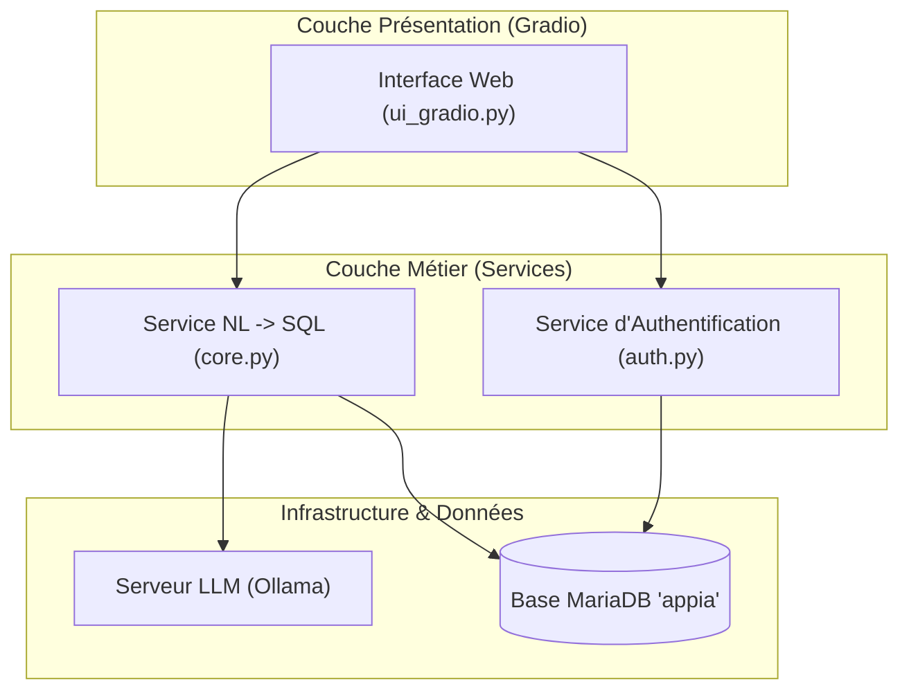

# Architecture Technique & Déploiement

Cette section détaille les composants logiciels et l'organisation technique de **NaturSQL**.

---

## 🏗️ Vue d'Ensemble des Composants

L'application NaturSQL est découpée en couches logiques indépendantes pour assurer une maintenabilité optimale :



---

## 📦 Stack Technologique

| Composant | Technologie | Rôle |
| :--- | :--- | :--- |
| **Interface Utilisateur** | [Gradio](https://gradio.app/) | Interface réactive en Python, formulaires de connexion et chat conversationnel. |
| **Modèle de Langage** | [Ollama](https://ollama.ai/) | Hébergement et inférence locale du LLM pour la traduction NL -> SQL. |
| **Base de Données** | [MariaDB](https://mariadb.org/) | Stockage relationnel des comptes utilisateurs et des maquettes d'enseignement (`appia`). |
| **Orchestration** | [Docker Compose](https://docs.docker.com/compose/) | Déploiement multi-conteneurs simplifié et reproductible. |
| **Documentation** | [MkDocs Material](https://squidfunk.github.io/mkdocs-material/) | Site statique de documentation déployé via GitHub Actions. |

---

## 🔒 Sécurité et Intégrité des Données

* **Exécution en lecture seule (`SELECT`)** : Toutes les requêtes générées par l'IA sont contrôlées avant exécution pour bloquer toute opération d'écriture ou de suppression (`INSERT`, `UPDATE`, `DELETE`, `DROP`).
* **Cloisonnement local** : Les échanges entre l'application et le LLM s'effectuent sur le réseau local interne ; aucune information sensible n'est transmise à l'extérieur.
* **Mots de passe hachés** : Les identifiants utilisateurs sont sécurisés en base de données selon les bonnes pratiques de cryptographie.

---

## 🚀 Déploiement avec Docker

Pour démarrer l'ensemble des services en local :

```bash
# Cloner le dépôt
git clone https://github.com/ChtiAxel/appli_intelligente.git
cd appli_intelligente

# Lancer les conteneurs (Base de données + Interface web)
docker compose up -d --build
```

L'interface est alors accessible directement sur `http://localhost:7860`.
